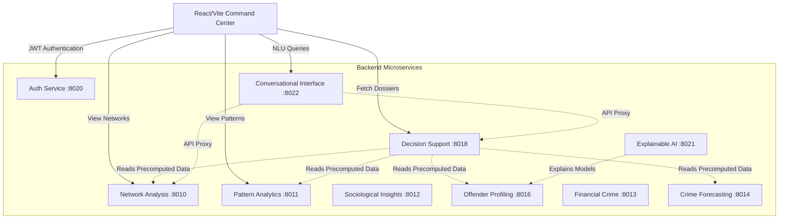
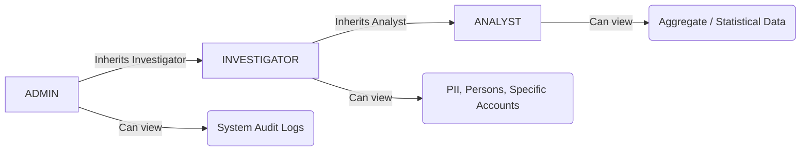

# Crime Intelligence Platform (CrimInt) 🛡️

A comprehensive, multi-pillar microservices architecture for advanced crime analytics, network analysis, forecasting, and investigator decision support.

This platform bridges the gap between raw law enforcement data (FIRs, suspect profiles, spatial records, financial transactions) and actionable intelligence. It replaces monolithic legacy systems with **10 independent FastAPI microservices** and a **modern, cinematic React/Vite Command Center frontend**.

---

## 🏛️ Architecture Overview

The system is designed around a microservices architecture. Each service is fully independent, with its own dependencies, models, and RBAC (Role-Based Access Control) verification logic. 



### The 10 Intelligence Pillars (Backend)
1. **Conversational Interface** (`:8022`): NLU routing layer that translates plain English queries into backend API calls.
2. **Network Analysis** (`:8010`): Co-accused graphs, organized group detection, and shortest-path analysis between suspects.
3. **Pattern Analytics** (`:8011`): Geospatial DBSCAN hotspot clustering and temporal emerging-spike detection.
4. **Sociological Insights** (`:8012`): Joins 2011 Census socioeconomic data with district crime rates.
5. **Offender Profiling** (`:8016`): Trained Machine Learning classifier for recidivism risk-tier prediction.
6. **Investigator Decision Support** (`:8018`): Synthesis layer that aggregates data from other pillars to generate prioritized case dossiers.
7. **Financial Crime / AML** (`:8013`): Anti-Money Laundering analysis running on the IBM AML benchmark (5M+ transactions).
8. **Crime Forecasting** (`:8014`): Poisson/RF forecasting backtested against historical NCRB district data.
9. **Explainable AI (SHAP)** (`:8021`): SHAP (SHapley Additive exPlanations) transparency layer for the ML models.
10. **Auth Service** (`:8020`): Stateless JWT login, RBAC enforcement (`ANALYST < INVESTIGATOR < ADMIN`), and audit logging.

### Command Center (Frontend)
Located in `frontend/web-app`, the UI is a **React + Vite + TypeScript** Single Page Application (SPA).
- **State Management**: Zustand & React Query.
- **Visualizations**: D3.js (Force-directed network graphs), Leaflet (Heatmaps), Recharts.
- **Design System**: Custom CSS variables, dark-mode cinematic aesthetics, and Framer Motion micro-animations.

---

## 🚀 Quick Start (Local Development)

### 1. Generate Demo Credentials
Before running the platform, generate the local demo user hashes. This script seeds the authentication database and prints out your temporary, one-time plaintext passwords.
```bash
python scripts/data_generation/auth/build_demo_users.py
```
*(Save the `admin` password printed to the console!)*

### 2. Start the Entire Platform (Windows)
We have provided an automated PowerShell script that loops through all 10 Python microservices, provisions their virtual environments (`.venv`), installs dependencies, starts them on their specific ports, and finally launches the React frontend.

Open a PowerShell terminal as Administrator at the project root and run:
```powershell
.\start_all.ps1
```

### 3. Login
- The script will automatically open the frontend at `http://localhost:5173`.
- Use the **Username**: `admin` and the **Password** you saved from Step 1.

---

## 🔒 Role-Based Access Control (RBAC)
The platform enforces strict data privacy rules statelessly across all microservices via JWTs.



| Role | Access Level |
|------|-------------|
| **ANALYST** | Can only view aggregate/statistical endpoints (e.g., district-level trends). |
| **INVESTIGATOR** | Can view PII-adjacent data (specific persons, accounts, and individual case dossiers). |
| **ADMIN** | Full system access, including the global audit logs. |

---

## ☁️ Deployment (Zoho Catalyst AppSail)
All backend services are designed to be deployed independently to **Zoho Catalyst AppSail**. 
- Pre-compiled Linux dependencies (wheels) are managed via `scripts/deploy/vendor_service_deps.py` to bypass Catalyst's lack of runtime `pip install`.
- See `docs/deployment/DEPLOY.md` for full instructions on uploading the generated `.zip` artifacts to the Catalyst console.

---

## 📖 Further Documentation
- **Architecture & Research**: `docs/architecture/`
- **Current Project Status & Audit**: `docs/PROJECT_STATUS.md`
- **Deployment Guide**: `docs/deployment/DEPLOY.md`
