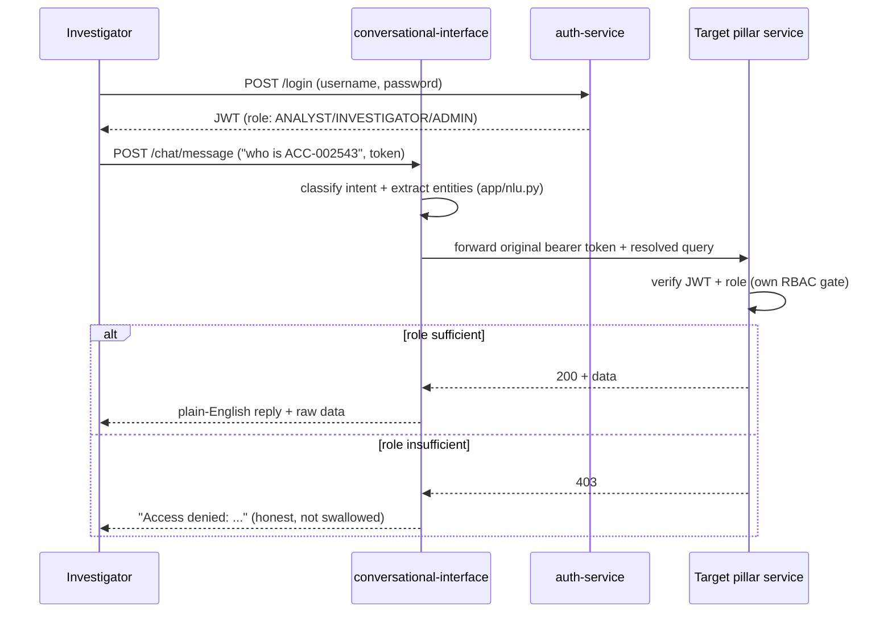
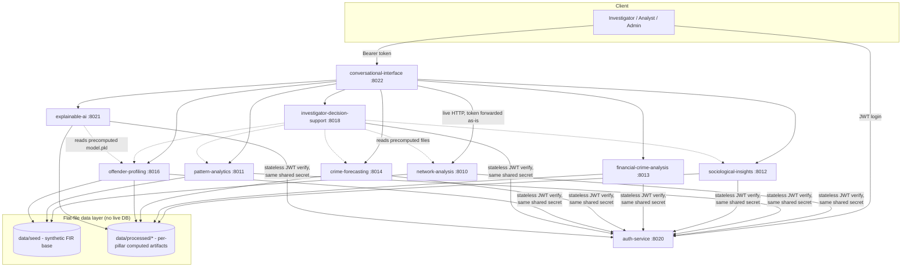

# Pitch Deck Content — Crime Intelligence Platform

Draft content for all 13 slides, grounded in what's actually built and
verified as of 2026-07-26 (see `docs/PROJECT_STATUS.md` for the full
audit this was written from). Numbers here are real — pulled from actual
`eval_stats.json`/`forecast_stats.json` files, not invented. A few slides
(5, 9, 10) need something from you (a screenshot, a design choice, a cost
assumption) — flagged explicitly rather than filled with placeholder
fluff.

---

## Slide 1 — Brief about the solution

**Crime Intelligence Platform** — a natural-language, role-gated crime
analytics system for Indian law enforcement, built as 10 independent
microservice "pillars" behind one conversational front door.

An investigator asks a plain-English question — *"who is ACC-002543"*,
*"forecast for Bidar"*, *"show suspicious accounts"* — and the platform
routes it to whichever of network analysis, pattern analytics,
sociological insights, financial-crime/AML detection, crime forecasting,
offender risk profiling, or investigator decision support actually holds
the answer, then returns a plain-English reply backed by the real
underlying data — with every prediction explainable (SHAP) and every
access decision role-gated (ANALYST / INVESTIGATOR / ADMIN), never a
black box handed to whoever's logged in.

---

## Slide 2 — Opportunities

**How is it different from existing tools?**
Most crime-analytics tooling is single-purpose — a dashboard, or a
forecasting model, or a network-graph viewer, built and shipped
separately. This platform unifies 10 of those capabilities behind one
coherent, consistently role-gated API surface, with a single
conversational entry point instead of 10 different tools an investigator
has to individually learn.

**How does it solve the problem?**
Crime data is fragmented — FIRs, financial records, offender histories,
census data, and case files live in disconnected systems. This platform
ingests that fragmentation once and turns it into three concrete
investigator-facing outputs: (1) **who** is connected to whom and how
risky they are, (2) **where and when** crime is concentrating or trending,
and (3) **why** a model said what it said — synthesized into a single
person/district dossier instead of ten separate reports.

**USP**
1. **Explainability as its own pillar**, not a bolt-on — every risk score
   ships with a SHAP breakdown of exactly which factors drove it.
2. **RBAC baked into every service**, not the platform edge — PII-adjacent
   endpoints (person/account-level) are gated at `INVESTIGATOR`+ in all 8
   analytics services individually, verified with real 401/403 tests.
3. **Grounded in real data where it's available** — the financial-crime
   pillar runs on IBM's real AML benchmark (5.08M real transactions) and
   sociological-insights joins real 2011 Census data, not 100% synthetic
   numbers dressed up as real.
4. **One natural-language layer over all of it** — no need to learn 10
   different REST APIs to get an answer.

---

## Slide 3 — Features

- **Conversational query interface** — plain-English questions routed to
  the right analytics engine automatically, multi-turn context (pronoun
  resolution across follow-up questions).
- **Criminal network analysis** — co-accused graphs, organized-group /
  community detection, key-actor ranking, shortest association path
  between two suspects, repeat-offender lookup.
- **Crime pattern & hotspot analytics** — DBSCAN geospatial hotspot
  clustering, district severity tiering (PCA + K-Means), temporal
  trend/emerging-spike detection, modus-operandi similarity matching.
- **Sociological risk correlation** — real Census socioeconomic data
  joined against district-level crime rates.
- **Offender risk profiling** — trained recidivism classifier
  (365-day reoffense probability), benchmarked against a rule-based
  baseline.
- **Financial crime / AML detection** — suspicious-account flagging,
  laundering-pattern detection, and account-path tracing over a
  5-million-transaction real dataset.
- **Crime forecasting** — district-level forecasts backtested against
  real historical NCRB data across three held-out years.
- **Investigator decision support** — a single synthesized dossier per
  person/district pulling from every other pillar at once, plus a
  case-priority queue.
- **Explainable AI** — SHAP-based, per-prediction driver breakdown for
  every risk score the platform produces.
- **RBAC / governance** — JWT login, three roles, and an audit log of
  every access-denied event across the platform.

---

## Slide 4 — Process flow / use-case diagram

**Use cases by role:**

| Role | Can do |
|---|---|
| ANALYST | Aggregate/statistical queries only — hotspots, district trends, forecasts |
| INVESTIGATOR | Everything ANALYST can, plus person/case/account-level lookups (dossiers, risk scores, network ties) |
| ADMIN | Everything INVESTIGATOR can, plus the audit log |

---

## Slide 5 — Wireframes / mockups

**Not built yet** — this is a backend-first prototype (10 REST APIs, no
frontend). `frontend/web-app/` exists as an empty scaffold in the repo but
has zero implementation. Right now the only interactive surface is each
service's auto-generated Swagger UI at `/docs`.

Two honest options for this slide:
- Mark it explicitly optional/skipped, since the brief allows that, and
  spend the slide time on the architecture/tech slides instead.
- Or sketch a minimal concept: a single chat panel (mirrors
  `POST /chat/message`) with a side panel showing the raw structured data
  returned alongside the plain-English reply, plus a role badge showing
  the logged-in user's access tier. I can mock this up as an HTML/CSS
  wireframe artifact if you want one — say so and I'll build it.

---

## Slide 6 — Architecture diagram

Key architectural decisions worth calling out on this slide:
- **Stateless JWT verification** — every service holds the same shared
  secret and verifies tokens itself; no per-request callback to
  auth-service.
- **File-reading over live HTTP everywhere except one deliberate
  exception** (`conversational-interface`, which has to field
  unpredictable queries across all 7 analytics domains) — traded for demo
  reliability and graceful degradation.
- **No live database** — every service loads flat files (CSV/JSON/pkl)
  once at startup and serves from memory.

---

## Slide 7 — Technologies used

- **Language/runtime**: Python 3.13
- **API framework**: FastAPI + Uvicorn (ASGI), Pydantic v2 / pydantic-settings
- **Data processing**: pandas, NumPy
- **ML/modeling**: scikit-learn (Random Forest recidivism classifier),
  SHAP (model explainability)
- **Graph analysis**: NetworkX
- **Auth**: PyJWT (stateless verification), bcrypt (password hashing)
- **Inter-service HTTP**: httpx
- **Testing**: pytest (122 tests across 10 services)
- **Deployment**: Zoho Catalyst AppSail (Catalyst-Managed Python 3.13
  Runtime, one service per AppSail instance)

---

## Slide 8 — Catalyst services used

- **AppSail (Catalyst-Managed Python Runtime)** — all 10 backend
  microservices run as independent AppSail services, each with its own
  startup command, memory allocation, and environment variables.

That's the honest current answer — nothing else in the Catalyst product
suite is wired in yet. If you want this slide to look more complete,
worth deciding now (not fabricating after the fact) whether to actually
adopt any of these before presenting:
- **Cloud Scale Data Store** — would replace the current flat-file
  per-service data loading with a real managed store; a genuine
  architecture upgrade, not just a slide-filler.
- **Cron / Event functions** — could run the data-generation/model-retrain
  scripts on a schedule instead of manually.

---

## Slide 9 — Estimated implementation cost (optional)

Real Catalyst pricing specifics for AppSail weren't confirmable from
public docs during this build (flagged already in `DEPLOY.md`). What is
confirmed: Catalyst has a free tier, and a **$5/project/month minimum**
kicks in once any resource in a project exceeds free-tier limits — running
10 always-on AppSail instances is a realistic candidate for that.

Recommend either:
- Marking this slide "cost estimate pending confirmation from Catalyst's
  console billing page" rather than a number that isn't verified, or
- Checking the console's actual billing/usage page (Project-Rainfall →
  Billing) for a real projected number before the presentation — that's a
  five-minute check that gets you a real figure instead of a guess.

---

## Slide 10 — Snapshots of the prototype

I can't generate real screenshots — here's exactly what to capture, in
order of how well they'll demonstrate the platform:

1. **Swagger UI** (`/docs`) for `auth-service` (already live) — shows the
   real endpoint list and auth flow.
2. A successful `POST /login` in Swagger, showing the returned JWT.
3. `POST /chat/message` on `conversational-interface` (once deployed) with
   a real question and its plain-English reply — this is the single most
   compelling shot since it shows the whole platform working end-to-end
   in one screen.
4. The Catalyst console's AppSail overview page showing multiple services
   with **Live** status and instance counts.
5. A 403 response for an under-privileged role hitting an
   INVESTIGATOR-gated endpoint — demonstrates the RBAC actually works,
   not just that it exists in the README.

---

## Slide 11 — Prototype performance report / benchmarking

Real numbers, pulled directly from this build's evaluation artifacts:

**Test coverage**: 122 automated tests across all 10 services, all
passing (includes real 401/403 RBAC checks, not just happy-path).

**Offender risk model** (`offender-profiling`) — Random Forest selected
over Logistic Regression and a rule-based baseline, evaluated on a
held-out test set of 1,361 case appearances (827 people):

| Model | Precision | Recall | F1 | ROC-AUC |
|---|---|---|---|---|
| Baseline rule (prior-case count) | 0.348 | 0.578 | 0.435 | — |
| Logistic Regression | 0.351 | 0.525 | 0.421 | 0.633 |
| **Random Forest (selected)** | **0.379** | **0.559** | **0.452** | **0.651** |

**Crime forecasting** (`crime-forecasting`) — backtested against 3 real
held-out years (2010–2012) across 1,914 district/crime-type series:
naive baseline beaten in **57.1%** of series; mean backtest MAE 255.2
(naive) vs. 286.9 (moving average) vs. 316.7 (linear trend) — naive
remains hard to beat on this dataset, an honest finding worth stating as
such rather than picking whichever number looks best.

**Financial crime / AML detection** (`financial-crime-analysis`) — over
515,080 real accounts (6,357 true laundering accounts) and 5.08M real
transactions: HIGH-risk flag precision 0.149 / recall 0.015; MEDIUM-or-
HIGH flag precision 0.129 / recall 0.107. These are intentionally
conservative rule-based thresholds, not a trained classifier — worth
framing as "a first-pass screening signal, not a final determination" on
the slide, since that's what the numbers actually support.

---

## Slide 12 — Links

- **GitHub (public repo)**: https://github.com/madhav-gfn/crime-intelligence-platform
- **Demo video (3 min)**: not recorded yet — needs to happen before
  submission.
- **Deployed link**: only `auth-service` is confirmed live so far
  (`https://auth-service-50042931907.development.catalystappsail.in/health`).
  The other 9 services are built and zipped, ready to deploy via the
  Catalyst console (`docs/deployment/DEPLOY.md`), but not yet uploaded —
  this needs to happen before this slide (and the demo video) can show
  the full platform rather than one service.

---

## Slide 13 — Additional details / future development

**Explicitly not built, real gaps (not oversights)**:
- Judicial/legal NLP (structuring FIRs, judgments, summarization) — no
  corresponding pillar exists at all.
- LLM-based conversational understanding — current NLU is deterministic
  regex/keyword matching; a Groq-backed swap is scoped and ready
  (`app/nlu.py`'s `parse()` is the identified seam), just not built yet.
- Multi-agent OSINT web intelligence (darknet/forum monitoring).
- Graph Attention Network-based link prediction (both network-analysis
  and financial-crime-analysis use simpler graph algorithms today).
- A formal fairness/bias-auditing pipeline (FairLens-style) — some
  implicit mitigation exists (no protected attributes in the risk model's
  feature set), but no dedicated auditor.

**Near-term roadmap**:
- Frontend (currently API-only, Swagger UI is the only interactive
  surface).
- Admin-gated user-management endpoint (`POST /api/auth/users`) — right
  now demo accounts are provisioned by a local script, not an API.
- Cross-service integration tests — current coverage is per-service unit
  tests only.
- CI/CD — every deploy so far is a manual Catalyst console upload.
- Cryptographically sealed audit log (currently a plain in-memory list) —
  needed for genuine DPDPA-grade compliance claims.
